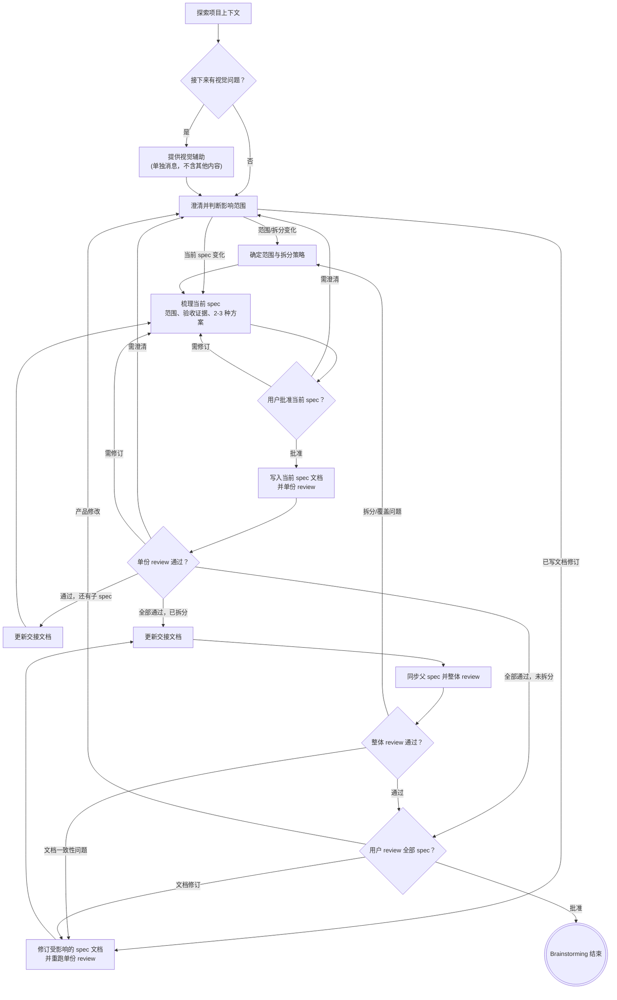

# 把想法梳理成验收驱动的 Spec

通过自然、协作式对话，帮助把想法变成验收驱动的 spec。

先理解当前项目上下文，再一次只问一个问题来澄清需求。当你已经理解要交付什么、以及如何验证它时，向用户展示 spec 并获得批准。

## 硬性门禁

- **禁止：** 在 spec 获得用户批准前，调用任何实现类 skill、写代码、搭建项目脚手架，或采取任何实现动作。
- **禁止：** 在父子 spec 场景中一次性写完多个剩余子 spec。拆分追踪、命名、相对链接和共享约束继承规则见 [split-spec-conventions.md](./split-spec-conventions.md)。
- **禁止：** 因为项目里已经存在一组 spec，就默认把新需求写成那组 spec 的新 slice 或子 spec。已有 spec 只能作为上下文；只有用户明确要求扩展那组父 spec，或澄清后确认新需求属于该父 spec 已批准目标 / `Candidate Future Split Specs`，才能继承其 topic 前缀、slice 编号和父子关系；否则必须为新需求创建独立 spec 或新的父子 spec 集合。
- **适用范围：** 所有项目，无论看起来多简单。
- **恢复规则：** review 或用户反馈要求回退时，先判断反馈影响的是产品语义、范围拆分、当前 spec 内容，还是已写出的多份 spec 文档。回到能解决问题的最早必要阶段，不要无条件重跑整条流程。
- **Review 修订顺序：** 单份 spec 或整体 spec set 的 `initial full review` 返回 Issues Found 后，必须按 `记录 blocker verdict -> 关闭旧 reviewer -> 修订前 git add -A 固定上一轮已审 baseline -> 修改 spec -> 保持本轮 fix 为 unstaged diff -> fresh reviewer focused re-review` 执行。
- **禁止：** focused re-review 前再次 `git add`。reviewer 必须用 `git diff` 查看本轮 fix，必要时用 `git diff --staged` 理解上一轮已审 baseline；如果没有 unstaged diff，先停下确认是否误 stage 或实际未修改。
- **Review 通过后推进基线：** 只有 focused re-review 返回 Approved 后，才运行 `git add -A` 把最终获批 spec 状态推进为新的 staged baseline；不要自动提交 spec 文档。
- **升级规则：** 如果修订改变产品目标、拆分边界、公共入口、验收策略、核心失败模式，或大范围重写 spec，不走 focused re-review，改派 `initial full review`。

## 反模式：“这个太简单了，不需要 Spec”

每个项目都要走这个流程。待办列表、单函数工具、配置改动——都一样。“简单”项目最容易因为未经检查的假设造成返工。spec 可以很短，但必须说明用户可见行为或公共接口会发生什么变化，以及如何验证完成。

## Checklist

你必须为以下每一项创建任务，并按顺序完成：

1. **探索项目上下文** — 检查文件、文档、近期提交
2. **提供视觉辅助**（如果接下来会涉及视觉问题）— 这必须是单独一条消息，不能和澄清问题混在一起。见下方“视觉辅助”章节
3. **提出澄清问题** — 一次只问一个问题，理解目标、约束、成功标准
4. **识别范围和工作量** — 判断是否需要拆成多个更小的验收驱动 spec
5. **定义验收证据** — 识别公共入口、可观察行为、失败模式、自动化验证
6. **提出 2-3 种方案** — 说明权衡，并给出你的推荐
7. **展示验收驱动的 spec** — 按复杂度分章节展示，每个章节都获取用户确认
8. **写入 spec 文档** — 保存到 `docs/LittlePower/specs/YYYY-MM-DD-<topic>-spec.md`
9. **Subagent review spec** — 必须启动同模型、最高推理强度的 reviewer subagent，使用 `spec-document-reviewer-prompt.md` 审查 spec
10. **更新交接文档**（如果拆分成父子 spec）— 每写完或修订一个子 spec 后，更新 `./.tmp/brainstorming-handoff-YYYY-MM-DD-<topic>.md`
11. **Subagent review spec set**（如果拆分成父子 spec）— 父 spec 和所有子 spec 都通过单份 review 后，必须启动整体 reviewer subagent 审查整组 spec；未拆分的单份 spec 跳过此步骤
12. **用户 review 全部 spec** — 请用户 review 已写好的 spec；用户批准后，brainstorming 结束

## 流程图

**终态是一个或多个已批准的验收驱动 spec。** 用户批准全部 spec 后，brainstorming 结束。如果需求范围过大、风险过高或验收矩阵过复杂，继续把需求拆成多个更小的验收驱动子 spec，要求每个子 spec 能被独立 review、独立实现、独立验收。未拆分的单份 spec 通过单份 subagent review 后进入用户 review；拆分后的父 spec 和所有子 spec 都必须通过单份 subagent review，整组 spec 也必须通过整体 subagent review。

## 流程细节

**理解想法：**

- 先检查当前项目状态（文件、文档、近期提交）
- 在深入提问前先评估范围：如果请求包含多个独立子系统（例如“做一个包含聊天、文件存储、计费和分析的平台”），立刻指出需要先拆分。不要把时间花在澄清一个本应先拆分的大项目细节上。
- 如果项目太大，无法放进单个 spec，帮助用户拆成子项目：哪些部分相互独立、它们如何关联、应该按什么顺序梳理。父 spec 只追踪整体目标和子 spec 进度；每个子项目都有自己的验收驱动子 spec。
- 对范围合适的项目，一次只问一个问题来澄清想法
- 优先使用多选问题；开放问题也可以
- 每条消息只问一个问题。如果一个主题需要继续深入，就拆成多个问题
- 重点理解：目标、约束、用户可见行为、公共接口、失败模式、非目标、成功标准
- 从 review gate 或用户 review 回到澄清阶段时，澄清后必须判断影响范围：如果改变目标、公共入口、风险边界或拆分方式，回到范围与拆分；如果只影响当前 spec，回到当前 spec 的范围、验收证据或方案；如果只影响已写文档表述，定位并修订受影响的 spec 文档。

**识别范围和工作量：**

- brainstorming 负责把需求切到可实现、可验收、可 review 的粒度。如果一个 spec 不能被一个 agent 在一次正常实现会话中完整理解、实现并通过验收验证，它就太大了，必须拆分。
- 任一信号命中时，优先考虑拆成多个 spec：包含 3 个以上独立用户目标；任一 slice 可以独立上线或独立验收；同时涉及 CLI、API、UI、配置、文件格式、事件协议等多个公共入口；涉及新持久化模型、迁移、权限、生命周期状态机、后台任务；预计影响 4 个以上主要模块/包；需要理解多个互不相邻的子系统；关键 AC 超过约 8-12 条；涉及数据迁移、兼容性破坏、用户数据、计费、安全、权限或外部集成；粗略预计新增/修改超过约 1-2k 行；可能演变成上万行新增代码。
- **Spec 长度信号：** 如果单个 spec 超过约 500 行，把它视为强拆分信号。优先寻找独立用户目标、公共入口、数据生命周期阶段或风险边界，将其拆成多个更小的验收驱动 spec。
- 只有当一个超过 500 行的 spec 仍然是单一内聚交付物，且长度主要来自必要的验收矩阵或接口示例，而不是实现步骤时，才保留它。
- 常见拆分维度：按用户 journey 拆；按公共入口拆；按数据生命周期拆；按风险边界拆；按可独立验收的 feature slice 拆。
- 父子 spec 的拆分追踪、命名、相对链接和 `Global Constraints` 继承规则统一见 [split-spec-conventions.md](./split-spec-conventions.md)。

**定义验收证据：**

- spec 是唯一持久化事实来源。它负责产品语义；不要把这些语义留给后续实现过程去发明。
- 找出行为被触发或观察到的每一种公共方式：CLI 命令、API endpoint、UI 流程、文件格式、配置项、事件、日志、持久化产物，或其他外部契约。
- 对每个 feature slice，把"行为契约"和"如何自动化验证"一起写进单一 `Acceptance Criteria` 章节：每条 AC 自带触发动作、必须可观察的结果，以及对应的验证手段；优先使用可在 CI 中运行、通过公共入口执行的集成测试或端到端测试。`Acceptance Criteria` 是 feature slice 中承载验收行为契约和验证手段的唯一章节。
- 把 slice 内对所有 AC 都生效的测试基线（主路径 boilerplate、默认断言层级、防 mock 逃逸禁令、调试产物落盘约定）抽到 `Shared Verification Baseline` 子段，避免在每条 AC 内重述。
- 如果某条 AC 用集成/E2E 测试覆盖不合理，在该 AC 的"降级理由"子项中说明替代自动化检查方式，以及为什么它足够；主路径直接覆盖的 AC 省略该子项。
- 每条 AC 的"必须可观察"必须完整覆盖该 AC 的行为契约（状态变化、产物、UI/API 输出、错误反馈），不得为了避免与"验证手段"重复而缩水；"验证手段"只补充测试技术细节（测试类型、复用入口、关键断言点），不重述行为契约。
- 包含重要失败场景和边界场景。如果 feature slice 只描述 happy path，它就是不完整的。
- 写清非目标和边界，避免 agent 扩大范围或用臆造行为填补空白。
- 明确 mock/stub 边界。只有在不可避免时，才允许 fake 外部服务；核心行为不得通过 mock 逻辑、no-op 路径、硬编码 fixture 或直接状态修改来满足。

**探索方案：**

- 提出 2-3 种不同方案，并说明权衡
- 用对话方式展示选项，给出你的推荐和理由
- 先给推荐方案，再解释为什么

**展示 spec：**

- 当你已经理解要构建什么、以及如何验证它时，展示 spec
- 根据复杂度调整对话展示时的每个章节长度：简单问题几句话即可，复杂问题最多约 200-300 字；最终写入文档的 spec 可以更详细
- 每展示一个章节，都询问用户目前看起来是否正确
- 覆盖：feature slices、公共接口/UI、可观察行为、状态变化、错误处理、非目标、自动化验收
- 如果有内容不清楚，随时回到澄清阶段。澄清后按影响范围恢复：范围或拆分变化回到“识别范围和工作量”；当前 spec 内容变化回到“定义验收证据”或“探索方案”；纯文字修订回到对应 spec 文档修订。

**Spec 结构：**

除非用户要求其他格式，否则按下面的模板文件生成 spec：

- 未拆分单份 spec：见 [single-spec-template.md](./single-spec-template.md)
- 已拆分子 spec：见 [child-spec-template.md](./child-spec-template.md)
- 已拆分父 spec：见 [parent-spec-template.md](./parent-spec-template.md)
- 父子 spec 交接文档：见 [brainstorming-handoff-template.md](./brainstorming-handoff-template.md)

补充规则：
- Feature slice 的 checkbox 对应该 slice 的验收已通过，而不是 brainstorming 阶段完成、创建文件、编写 helper、运行命令之类的实现杂项。
- 父 spec 负责整体目标、共享 `Global Constraints`、拆分边界、已写子 spec 链接和未来候选拆分。
- 子 spec 负责具体行为、公共接口、错误边界、验收标准和自动化验证。
- 父子 spec 的共享约束继承和相对链接写法见 [split-spec-conventions.md](./split-spec-conventions.md)。

**父子 Spec 交接文档：**

如果需求被拆成父子 spec，每写完或修订一个子 spec 并通过单份 review 后，必须更新交接文档：

- 路径使用 `./.tmp/brainstorming-handoff-YYYY-MM-DD-<topic>.md`
- 如果交接文档不存在，自行创建并写入当前交接内容
- 交接文档使用中文编写
- 交接文档只记录后续 agent 恢复工作所需事实，不重复完整 spec 内容
- 交接文档不替代父 spec 的 `Split Specs` 和 `Candidate Future Split Specs`；候选子 spec 信息仍以父 spec 为准
- 未拆分的单份 spec 不需要交接文档

交接文档模板见 [brainstorming-handoff-template.md](./brainstorming-handoff-template.md)。

**隔离性和清晰性设计：**

- 把系统拆成更小的单元：每个单元都有清晰职责，通过明确接口通信，并且能被独立理解和测试
- 对每个单元都应该能回答：它做什么、如何使用它、它依赖什么
- 不读内部实现，别人能理解一个单元做什么吗？能在不破坏调用方的情况下替换内部实现吗？如果不能，边界就需要调整
- 小而边界清晰的单元也更便于 agent 工作：你能更好地在上下文中理解代码；当文件变得很大时，通常说明它承担了太多职责

**在现有代码库中工作：**

- 提出改动前，先探索当前结构。遵循现有模式。
- 如果现有代码的问题会影响当前工作（例如文件过大、边界不清、职责纠缠），把有针对性的改进写进 spec 约束或 feature slice 中——这就是优秀开发者在修改相关代码时会做的事。
- 不要提出无关重构。只做服务于当前目标的改动。

## 设计之后

**文档：**

- 把已验证的 spec 写入 `docs/LittlePower/specs/YYYY-MM-DD-<topic>-spec.md`
  - 用户偏好的 spec 路径优先于这个默认路径
- 如果拆成多个子 spec，父子 spec 的命名、追踪和链接规则统一遵循 [split-spec-conventions.md](./split-spec-conventions.md)
- 不要自动提交 spec 文档；用户决定是否提交

**Spec Review Gate：**
写完单份或多份关联 spec 文档后，必须启动一个 reviewer subagent 审查已写好的 spec：

- **强制启动：** 必须启动 subagent；不要因为任何默认“不启动 subagent”的原则而跳过。
- **模型要求：** reviewer subagent 必须使用与当前 agent 相同的模型。
- **推理强度：** reviewer subagent 必须使用当前环境支持的最高推理强度（例如 `xhigh`、`max` 或等价设置）；如果环境不支持设置推理强度，使用可用默认值并说明。
- **Prompt：** 使用 `skills/brainstorming/spec-document-reviewer-prompt.md`，并传入实际 spec 文件路径、目标项目仓库路径和 review 类型；focused re-review 还必须传入上一轮 blocker verdict 与修订摘要。
- **职责：** reviewer 只审查 spec 是否验收驱动、范围合适、可独立 review/实现/验收、CI 验收充分、且没有 mock/stub/no-op 逃逸路径；不要让 reviewer 重写 spec。
- **处理结果：** 如果 reviewer 返回 Issues Found，按问题类型恢复流程：产品语义不清时回到澄清；范围过大或边界错误时回到范围与拆分；验收证据、方案、公共接口或文档表述有问题时修订当前 spec，并再次启动新的 reviewer subagent。修订后的 re-review 默认按下方 Focused Re-review 规则执行。只有 reviewer 返回 Approved 后，当前 spec 才能进入后续整体 review。

**Spec Review 的 Focused Re-review：**
当 review 或用户反馈要求修改已写好的 spec 时，不要让下一轮 fresh reviewer 默认从头完整审查。默认使用 focused re-review，只验证上一轮阻塞问题是否解决、本轮修订是否引入新的阻塞问题、以及被修订章节的最终内容是否仍与 spec 整体一致。

- **Fresh reviewer 仍然必须使用：** 记录上一轮 verdict 后关闭旧 reviewer；re-review 派发新的 reviewer subagent。
- **Git index 基线：** 该规则假设 brainstorming 阶段目标仓库没有其他并行写入。在修订前，于目标项目仓库运行 `git add -A`，把上一轮已审 spec 状态固定为 staged baseline。修订 spec 后保持本轮修订为 unstaged diff；不要在 re-review 前再次 `git add`。如果发现明显无关的未提交改动，先停下协调，不要把无关 diff 带进 re-review baseline。
- **Prompt 输入：** focused re-review prompt 必须包含上一轮 blocker verdict、修订摘要、实际 spec 路径、目标仓库路径，以及 Git index 约定：`staged changes 是上一轮已审基线；unstaged changes 是本轮修订`。
- **Reviewer 查看方式：** reviewer 在目标仓库内用 `git diff` 查看本轮修订，必要时用 `git diff --staged` 理解已审基线；不要把完整 diff 粘进 prompt。
- **升级完整 review：** 如果本轮修订改变了产品目标、拆分边界、公共入口、验收策略、核心失败模式，或大范围重写 spec，focused re-review 不够，必须改派 `initial full review`。
- **通过后推进基线：** focused re-review Approved 后，在目标项目仓库运行 `git add -A`，把最终获批 spec 状态推进为新的 staged baseline，再进入后续整体 review 或用户 review。不要自动提交 spec 文档。

**Spec Set Review Gate（仅限拆分后的父子 spec）：**
父 spec 和所有已写出的子 spec 都分别通过单份 Subagent Review Gate 后，必须启动一个整体 reviewer subagent 审查整组 spec：

- **强制启动：** 必须启动 subagent；不要因为任何默认“不启动 subagent”的原则而跳过。
- **模型要求：** 整体 reviewer subagent 必须使用与当前 agent 相同的模型。
- **推理强度：** 整体 reviewer subagent 必须使用当前环境支持的最高推理强度（例如 `xhigh`、`max` 或等价设置）；如果环境不支持设置推理强度，使用可用默认值并说明。
- **Prompt：** 使用 `skills/brainstorming/spec-set-reviewer-prompt.md`，并传入父 spec 路径、所有已写出的子 spec 路径、目标项目仓库路径和 review 类型；focused re-review 还必须传入上一轮整体 blocker verdict 与修订摘要。
- **职责：** reviewer 只审查父子 spec 的整体一致性、覆盖完整性、拆分追踪、命名规则、跨 spec 冲突和范围漂移；不要让 reviewer 重写 spec。
- **处理结果：** 如果整体 reviewer 返回 Issues Found，修订相关 spec；被修订的单份 spec 必须重新通过单份 reviewer，然后再次启动新的整体 reviewer subagent。修订后的整体 re-review 默认按 Focused Re-review 规则只审上一轮跨文档 blocker 和本轮修订；如果修订改变拆分边界、增删子 spec、改变父 spec 交付地图或大范围重写，升级为完整整体 review。只有整体 reviewer 返回 Approved 后，才能进入用户 Review Gate。

**用户 Review Gate：**
未拆分的单份 spec 通过单份 review 后，请用户 review 该 spec。拆分后的父 spec 和所有子 spec 都通过单份 review，且整组 spec 通过整体 review 后，请用户 review 全部已写好的 spec：

> "Spec 已写入。请 review 父 spec 和所有子 spec；如果你希望修改，请告诉我。"

等待用户回复。如果用户要求修改，先定位反馈影响哪些 spec 文档，再修订所有受影响的 spec。任何 spec 文档被修改后，该文档必须重新通过单份 reviewer；如果父子集合受影响，整组 spec 也必须重新通过整体 reviewer。未拆分 spec 在单份 reviewer 再次 Approved 且用户批准后结束；拆分 spec 只有整体 reviewer 再次 Approved 且用户批准后，brainstorming 才能结束。

**结束：**

- 用户批准 spec 后，brainstorming 到此结束。
- 如果用户批准后又发现缺少产品决策，回到 spec 继续澄清和修订。

## 核心原则

- **一次只问一个问题** — 不要同时抛出多个问题压倒用户
- **优先多选** — 多选通常比开放问题更容易回答
- **严格 YAGNI** — 从 spec 中移除不必要功能
- **探索替代方案** — 确定方案前，始终提出 2-3 种选择
- **增量验证** — 展示 spec 章节，获得批准后再继续
- **验收驱动范围** — 只有可观察行为和验证证据都明确后，功能才算被定义清楚
- **Spec 拥有语义** — 不要把产品/API/UI 行为决策推迟到实现阶段
- **保持灵活** — 有不清楚的地方就回头澄清

## 视觉辅助

浏览器版视觉辅助可用于在 brainstorming 期间展示 mockup、图表和视觉选项。它是一个工具，不是一种模式。用户接受视觉辅助，只表示后续遇到适合视觉表达的问题时可以使用；不表示每个问题都要通过浏览器处理。

**提供视觉辅助：** 当你预期接下来会涉及视觉内容（mockup、布局、图表）时，只询问一次用户是否同意：
> "接下来有些内容可能用浏览器展示会更容易理解。我可以在过程中做 mockup、图表、对比图和其他视觉材料。这个功能还比较新，也可能消耗较多 token。要试试吗？（需要打开一个本地 URL）"

**这必须是一条独立消息。** 不要把它和澄清问题、上下文总结或其他内容合并。这条消息只能包含上面的邀请语，不能有其他内容。等待用户回复后再继续。如果用户拒绝，就继续用纯文本 brainstorming。

**逐问题判断：** 即使用户同意使用视觉辅助，也要对每一个问题单独判断应该使用浏览器还是终端。判断标准是：**用户看到它会不会比读文字更容易理解？**

- **使用浏览器**：内容本身是视觉性的——mockup、wireframe、布局对比、架构图、并排视觉设计
- **使用终端**：内容本身是文本性的——需求问题、概念选择、权衡列表、A/B/C/D 文本选项、范围决策

关于 UI 的问题不一定就是视觉问题。“这里的 personality 是什么意思？”是概念问题，使用终端。“哪种 wizard 布局更好？”是视觉问题，使用浏览器。

如果用户同意视觉辅助，在继续前阅读详细指南：
`skills/brainstorming/visual-companion.md`
