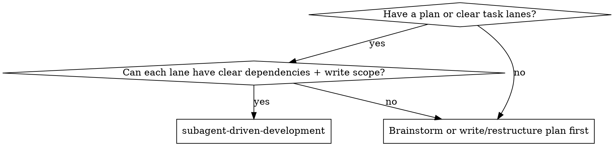
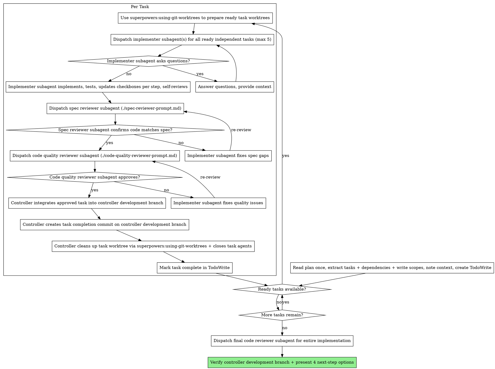

# Subagent-Driven Development

Execute implementation work by dispatching a fresh subagent per task lane, with two-stage review after each task, immediate integration of approved task branches, and explicit controller-branch completion at the end.

**Why subagents:** You delegate tasks to specialized agents with isolated context. By precisely crafting their instructions and context, you ensure they stay focused and succeed at their task. They should never inherit your session's context or history — you construct exactly what they need. This also preserves your own context for coordination work.

**Core principle:** Dependency-aware scheduling + fresh subagent per task + two-stage review (spec then quality) + explicit controller-branch completion = high quality, fast iteration.

If you start from unrelated failures instead of a written plan, first convert them into explicit task lanes with dependencies, write scopes, and verification, then run the same workflow.

## Required Worktree Workflow (Mandatory)

- Before dispatching any code-changing task, invoke `superpowers:using-git-worktrees`.
- That skill owns controller development branch detection, isolated task worktree creation, merge-back mechanics, and task-worktree cleanup.
- This skill assumes each active code-changing task lane has exactly one assigned task worktree and task branch managed by `superpowers:using-git-worktrees`.
- A task keeps that same assigned task worktree and task branch across implementation, review fixes, checkbox updates, and re-review until it is integrated or explicitly reset.
- If isolated task worktrees cannot be established, downgrade that conflict group to sequential execution and state the reason explicitly.

## Skill Boundaries (Mandatory)

- `superpowers:using-git-worktrees` owns task worktree assignment, task branch isolation, merge-back, and cleanup.
- `superpowers:requesting-code-review` owns the standard code-reviewer contract used for code-quality review: review context packaging, placeholders, findings severity framework, and standard output format.
- This skill owns the spec-compliance reviewer prompt, workflow-specific review-stage wrappers, dependency scheduling, task-lane review timing, task-scoped fix/re-review loops, fresh-reviewer re-review, and agent lifecycle.

## Parallel Execution Hard Rules (Mandatory)

- If 2+ tasks are `ready`, independent, and have disjoint write scopes, you **MUST** dispatch them in parallel. Do not serialize by default.
- The controller may keep at most 5 active task lanes at once. A task's implementation, review, and fix loop occupies one lane until that task is complete or paused.
- Shared coordination files other than the plan stay with the controller development branch only.
- Each implementer subagent itself updates its own task's step checkboxes from its assigned task worktree immediately after each step's verification passes. The controller must not do this on the implementer's behalf.
- After a task passes final review, the controller integrates that task branch back into the controller development branch, creates the task completion commit there, cleans up its task worktree via `superpowers:using-git-worktrees`, and immediately closes that task's agents.
- If two ready tasks touch the same file or resource, run them sequentially.

## Review Posture (Mandatory)

- Implementers must self-review for completeness, obvious defects, missing tests, and out-of-scope changes before reporting `DONE`.
- Spec-compliance reviewers do **not** trust implementer claims. They read the code and compare it to the plan independently.
- Code-quality reviewers review the actual diff and resulting code, not the implementer's summary.
- The controller provides full task text and context directly. Do **not** make implementers open the plan file themselves.

## Event-Driven Review Pipeline (Mandatory)

- As soon as any task finishes implementation and local verification, dispatch that task's spec review immediately.
- As soon as spec review is approved, dispatch that same task's code-quality review immediately.
- Each reviewer dispatch covers exactly one task lane, one task branch, and one assigned task worktree.
- If 2+ independent tasks are awaiting review, dispatch their reviewers in parallel, subject to the active lane cap.
- If a review finds issues, record the verdict, close that reviewer immediately, fix that same task in its assigned task worktree, then dispatch a fresh reviewer for that same task only.
- If a review batch cannot be isolated by task/worktree, downgrade that batch to sequential review and record why.
- Keep other independent tasks running in parallel; do not block them on unrelated review/fix cycles.
- Do not introduce batch barriers such as:
  - "wait until all implementations finish before starting any reviews"
  - "wait until all reviews finish before starting any fixes"

## Subagent Lifecycle Rules (Mandatory)

- Never keep completed or idle agents open "just in case".
- Close each spec reviewer immediately after its verdict is captured.
- Close each code-quality reviewer immediately after its verdict is captured.
- If a reviewer requests changes, close that reviewer after its findings are recorded; the next review pass uses a fresh reviewer.
- Keep the implementer/fixer assigned to that task lane through its review-fix-re-review loop unless the lane is explicitly paused or handed off.
- Once code-quality review passes and the controller has integrated that task back into the controller development branch, immediately close the implementer/fixer agent for that task. The approving reviewer should already have been closed when its verdict was recorded.
- In Codex, explicitly call `close_agent` for every task agent as soon as it becomes idle.

## When to Use



**Use when:**
- You already have an implementation plan to execute, even if only some tasks can run in parallel.
- You have 2+ unrelated bugs, failures, or code-change requests that can be translated into explicit task lanes with dependencies and write scopes.
- Each task lane can have one owner, one task worktree, its own review loop, and independent integration back into the controller development branch.

**Don't use when:**
- The work is still exploratory and you do not yet understand task boundaries, dependencies, or write scopes.
- The change is so tightly coupled that splitting it into task lanes would be artificial; restructure the plan first.

### Example: unrelated failures become task lanes

Input:
- `tests/auth/login.test.ts` redirect failure
- `tests/api/users.test.ts` returns 500
- `tests/components/Button.test.tsx` snapshot mismatch
- `tests/utils/date.test.ts` timezone bug

Convert that into four task lanes with explicit owners, write scopes, and verification. Run the auth/API/button/date lanes in parallel only where their write scopes are disjoint. Each lane still follows the full workflow: task worktree, implementer, spec review, code-quality review, integration, task completion commit, and cleanup.

## The Process



## Tracking and Resume Rules

- Plan checkbox state is the persistent progress source of truth.
- TodoWrite is session-local execution tracking and must be rebuilt from plan checkbox state after restarts.
- Each implementer subagent itself updates its own task's step checkboxes (`- [ ]` → `- [x]`) in the plan file from its assigned task worktree immediately after each step's verification passes. The controller must not do this on the implementer's behalf.
- The controller does not separately update checkboxes; they arrive via the task branch merge.
- Each task should have one normal completion commit that includes code/test changes and the plan checkbox updates from the merge.
- Do not create standalone progress-only commits.

If a plan includes a non-checkbox `Task completion action`, execute it after the final verified checkbox step and before marking the task complete.

## Resume Consistency Check (Required After Interruptions)

Before resuming execution in an existing branch/session:

1. Compare plan checkbox state with current repo state (`git status`, recent commits, touched files).
2. Verify TodoWrite matches plan checkbox truth (rebuild TodoWrite if needed).
3. Inspect task worktrees managed by `superpowers:using-git-worktrees`:
   - If a completed task still has a task worktree, clean it up before continuing.
   - If an incomplete task has a task worktree, verify it matches the plan checkbox state before reusing it.
4. If plan state and repo state are mismatched, reconcile first by updating plan checkboxes to reflect verified reality; do not continue while plan state is stale.
5. Only resume task execution after plan, TodoWrite, git, and task-worktree state are aligned.

## Dependency Scheduling Rules

Build a dependency-aware execution queue before dispatching implementers.

- The controller reads the plan **once** at the start, extracts full task text, dependencies, and write scopes, and reuses that extracted context throughout the run.
- Parse each task's `Depends on` field and file write scope from the plan.
- A task is `ready` only when all dependencies are complete.
- Independent ready tasks **must** run in parallel when write scopes are disjoint.
- Default max concurrency is 5 implementer subagents.
- Use `superpowers:using-git-worktrees` to assign one isolated task worktree and task branch per active code-changing task lane.
- If more than 5 tasks are ready, dispatch the highest-priority 5 and keep the rest queued.
- If two ready tasks touch the same file, run them sequentially.
- On task completion, re-evaluate ready tasks and dispatch newly unblocked work immediately.
- Review scheduling is event-driven per task completion, not batch-driven by wave.

**Priority order for ready tasks:**
1. Tasks that unblock the most downstream tasks
2. Tasks with the smallest scope (faster feedback)
3. Original plan order (tie-breaker)

## Scope Expansion Conflict Protocol

If review or implementation reveals that a task's real write scope expanded beyond its declared scope, treat it as a scheduling conflict event.

1. Pause completion for that task (do not mark completed, do not commit).
2. Classify status as `NEEDS_CONTEXT` or `DONE_WITH_CONCERNS` with explicit out-of-scope files.
3. Remove or stash out-of-scope edits so only declared-scope changes remain for the current task.
4. Update dependency graph and ownership:
   - Add/adjust `Depends on` edges for newly discovered coupling
   - Assign one task as owner for each shared file
   - Convert conflicting tasks from parallel to sequential execution
5. If conflict affects active parallel workers, cap that conflict group at concurrency 1 until resolved.
6. Create follow-up task(s) for out-of-scope work, then resume normal scheduling.

Never force a task to completion when its write scope is ambiguous or conflicts with another active task.

## Model + Reasoning Policy

Use the same model as the current controller agent for every subagent in this workflow unless your human partner explicitly asks for a different model.

- Implementer subagents use `medium` reasoning.
- Spec-compliance reviewer subagents use `xhigh` reasoning.
- Code-quality reviewer subagents use `xhigh` reasoning.
- Final whole-implementation reviewers use `xhigh` reasoning.
- Do not switch to a different model as the default response to a blocked task. Add context, split scope, or escalate instead.

## Handling Implementer Status

Implementer subagents report one of four statuses. Handle each appropriately:

**DONE:** Proceed to spec compliance review.

**DONE_WITH_CONCERNS:** The implementer completed the work but flagged doubts. Read the concerns before proceeding. If the concerns are about correctness or scope, address them before review. If they're observations (for example, "this file is getting large"), note them and proceed to review.

**NEEDS_CONTEXT:** The implementer needs information that wasn't provided. Provide the missing context and re-dispatch.

**BLOCKED:** The implementer cannot complete the task. Assess the blocker:
1. If it's a context problem, provide more context and re-dispatch with the same model and `medium` reasoning
2. If the task is too large or ambiguous, break it into smaller pieces
3. If the plan itself is wrong, escalate to the human

**Never** ignore an escalation or force the same model to retry without changes. If the implementer said it's stuck, something needs to change.

## Prompt Templates

- `./implementer-prompt.md` - Dispatch implementer subagent
- `./spec-reviewer-prompt.md` - Dispatch spec compliance reviewer subagent
- `./code-quality-reviewer-prompt.md` - Dispatch code quality reviewer subagent

## Controller Development Branch Completion (Mandatory)

After the controller has integrated all task branches and removed their task worktrees via `superpowers:using-git-worktrees`, only the controller development branch should remain. Finish the run inside this skill.

### Step 1: Verify Tests On The Controller Development Branch

**Before presenting options, verify the full project test suite passes on the controller development branch:**

```bash
# Run the project's full test suite
npm test / cargo test / pytest / go test ./...
```

**If tests fail:**
```
Tests failing (<N> failures). Must fix before completing:

[Show failures]

Cannot proceed with merge/PR until tests pass.
```

Stop. Do not proceed to base-branch selection or branch options.

### Step 2: Determine The Base Branch

```bash
# Try common base branches
git merge-base HEAD main 2>/dev/null || git merge-base HEAD master 2>/dev/null
```

Or ask: "This development branch split from main - is that correct?"

### Step 3: Present Exactly These 4 Options

```
Implementation complete. What would you like to do?

1. Merge current development branch back to <base-branch> locally
2. Push current development branch and create a Pull Request
3. Keep the current development branch as-is (I'll handle it later)
4. Discard the current development branch

Which option?
```

**Do not add explanation.** Keep the options concise.

### Step 4: Execute Choice

#### Option 1: Merge Locally

```bash
# Switch to base branch
git checkout <base-branch>

# Pull latest
git pull

# Merge controller development branch
git merge <controller-branch>

# Verify tests on merged result
<test command>

# If tests pass
git branch -d <controller-branch>
```

#### Option 2: Push And Create PR

```bash
# Push controller development branch
git push -u origin <controller-branch>

# Create PR
gh pr create --title "<title>" --body "$(cat <<'EOF'
## Summary
<2-3 bullets of what changed>

## Test Plan
- [ ] <verification steps>
EOF
)"
```

#### Option 3: Keep As-Is

Report: "Keeping branch <controller-branch>."

#### Option 4: Discard

**Confirm first:**
```
This will permanently delete:
- Branch <controller-branch>
- All commits: <commit-list>

Type 'discard' to confirm.
```

Wait for exact confirmation.

If confirmed:

```bash
git checkout <base-branch>
git branch -D <controller-branch>
```

There is no worktree cleanup step here. The controller should already have removed every task worktree before this point.

## Example Workflow

```
You: I'm using Subagent-Driven Development to execute this plan.

[Use superpowers:using-git-worktrees to establish the controller development branch and task-worktree policy]
[Read the plan once: docs/superpowers/plans/feature-plan.md]
[Extract all 5 tasks with full text, dependencies, and write scopes]
[Create TodoWrite with all tasks initialized from plan checkbox state]
[Build ready queue; dispatch up to 5 independent ready tasks in parallel]

Task 1: Hook installation script (ready)

[Create Task 1 task worktree and task branch via superpowers:using-git-worktrees]
[Dispatch implementation subagent with full task text + context using controller model + medium reasoning]

Implementer: "Before I begin - should the hook be installed at user or system level?"

You: "User level (~/.config/superpowers/hooks/)"

Implementer:
  - Implemented install-hook command
  - Updated step checkboxes in the plan as each step verified
  - Added tests, 5/5 passing
  - Self-review: completeness checked, found I missed --force flag, added it
  - Ready for review (did not commit)

[Dispatch spec compliance reviewer using controller model + xhigh reasoning]
Spec reviewer: ✅ Spec compliant - all requirements met, nothing extra

[Dispatch code quality reviewer using controller model + xhigh reasoning]
Code reviewer: ✅ Approved

[Controller integrates Task 1 back into the controller development branch]
[Controller creates the Task 1 completion commit on the controller development branch]
[Controller cleans up the Task 1 task worktree via superpowers:using-git-worktrees]
[Controller closes Task 1 implementer/reviewer agents]
[Mark Task 1 complete in TodoWrite]
[Recompute ready queue]

...

[After all tasks]
[Dispatch final code reviewer using controller model + xhigh reasoning]
Final reviewer: All requirements met, ready to finish the controller development branch
[Verify tests on the controller development branch]
[Determine the base branch]
[Present the 4 controller-branch options: merge locally / push PR / keep branch / discard branch]
```

## Advantages

**vs. Manual execution:**
- Subagents follow TDD naturally
- Fresh context per task (no confusion)
- Parallel-safe (subagents don't interfere)
- Subagents can ask questions before and during work

**Efficiency gains:**
- No file-reading overhead for implementers (controller provides full task text directly)
- Controller curates exactly what context is needed
- Questions surface before work begins, not after
- Approved tasks integrate immediately instead of waiting for a batch barrier

**Quality gates:**
- Self-review catches issues before handoff
- Two-stage review: spec compliance, then code quality
- Review loops ensure fixes actually work
- Final controller-branch completion is explicit, not left vague

**Cost:**
- More subagent invocations (implementer + 2 reviewers per task + final reviewer)
- Controller does more prep work (extracting all tasks upfront)
- Review loops add iterations
- But catches issues early, which is cheaper than debugging later

## Red Flags

**Never:**
- Start implementation on `main`/`master` without explicit human consent
- Skip `superpowers:using-git-worktrees` before dispatching code-changing tasks
- Skip reviews (spec compliance **or** code quality)
- Proceed with unfixed issues
- Dispatch parallel implementers without dependency and write-scope checks
- Make a subagent read the plan file instead of providing full task text directly
- Ignore subagent questions
- Accept "close enough" on spec compliance
- Start code-quality review before spec compliance is ✅
- Wait for all implementations to finish before starting reviews
- Wait for all reviews to finish before starting fixes
- Leave a completed task worktree around after integration
- Create standalone progress-only commits
- Finish the run without re-verifying tests on the controller development branch
- Ask an open-ended "what should I do next?" instead of presenting the exact 4 completion options
- Delete the controller development branch without exact typed `discard` confirmation
- Reach for a separate finishing skill; controller-branch completion is part of this workflow

**If subagent asks questions:**
- Answer clearly and completely
- Provide additional context if needed
- Do not rush them into implementation

**If reviewer finds issues:**
- The same implementer fixes them
- The implementer applies those fixes in the same assigned task worktree
- The controller records the verdict and closes the reviewer that produced it
- The controller dispatches a fresh reviewer for the next pass
- The controller re-dispatches review for that same task immediately
- Repeat until approved
- Do not skip the re-review

**If subagent fails task:**
- The controller dispatches a fix subagent with specific instructions
- The controller does not try to fix manually in the controller session

## Integration

**Required workflow skills:**
- **superpowers:using-git-worktrees** - REQUIRED: owns task-worktree creation, merge-back, and cleanup
- **superpowers:writing-plans** - Creates the plan this skill executes
- **superpowers:requesting-code-review** - Provides the code-reviewer template and findings framework used by reviewer subagents

**Subagents should use:**
- **superpowers:test-driven-development** - Subagents follow TDD for each task
