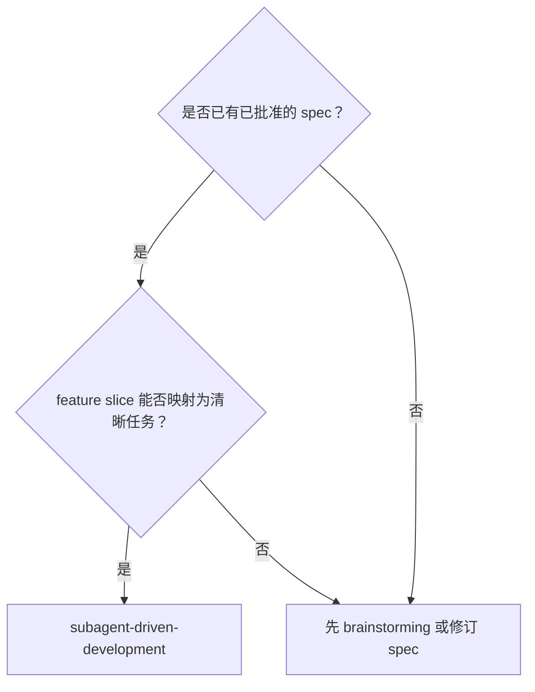

# Subagent 驱动开发

基于已批准的 spec 执行实现工作：按 feature slice 顺序派发全新的 implementer subagent，每个任务通过 spec review 和 code-quality review 后立即集成回 `controller` 开发分支，最后在 `controller` 分支完成整体验证。

**核心原则：** 已批准的 spec 是事实来源；每个任务使用隔离 worktree、全新 subagent、两阶段 review、同任务 fix/re-review 循环；通过后立即集成、更新 spec status、清理 worktree 并关闭 agent。

**不可谈判：** 这个 skill 强制使用 subagent 做实现和 review，并假设当前 harness 已具备可用的 subagent 能力。不能用 controller-only 执行替代。

**分支参考禁令：** 除非 human partner 明确要求，否则严禁参考仓库内其他分支的代码实现。当前分支上的已批准 spec、当前工作树和现有代码才是事实来源。

如果手上只有零散失败或模糊请求，先用 `brainstorming` 把行为、验收标准、公共入口和验证方式沉淀为已批准 spec，再运行本工作流。

## Spec Gate（强制）

在派发任何实现或 review 任务前，先确认：

1. 这项工作已有一份已批准的 spec。
2. 如果这项工作使用父/子 spec，除非 human partner 明确要求，否则当前轮次只实现一个已批准子 spec；不要实现其他子 spec，也不要实现父 spec 中仍列在 `Candidate Future Split Specs` 里的内容。
3. 每个待实现 feature slice 都有 `Implementation status: Not done`、具体行为、公共接口、验收标准和自动化验证指引。

如果 spec 缺少必要行为、公共入口、验收标准或验证细节，停止实现，回到 `brainstorming` 修订。不要在实现工作流里发明产品/API/UI 行为，也不要使用独立于 spec 之外的“实现任务文档”。

## Worktree 与 Skill 边界（强制）

- 在派发任何会改代码的任务前，先调用 `using-git-worktrees`。
- 每个会改代码的任务都有且只有一个由 `using-git-worktrees` 管理的任务 worktree 和任务分支。
- 同一个任务在实现、review 修复和 re-review 期间始终复用同一个任务 worktree，直到集成或显式重置。
- 共享协调文件，包括 spec 中的 `Implementation status`，只在 `controller` 开发分支工作区更新。
- `using-git-worktrees` 是任务 worktree 机制的事实来源；它约束任务 worktree/任务分支创建、稳定复用、集成机制和清理。
- 本 skill 负责 spec reviewer prompt、code-quality reviewer prompt、review 阶段包装、按 spec 顺序调度、任务级 fix/re-review 循环、fresh reviewer 规则和 agent 生命周期。

## 任务执行规则（强制）

- 当前任务未完成 spec review、code-quality review、集成和清理前，不要开启下一个会改代码的实现任务。
- Subagent 不继承 controller 的完整 session 历史；controller 只构造该任务真正需要的输入。
- Controller 必须提供已批准 spec 路径、feature slice 标识、AC ID 集合、公共入口提示、验证预期和必要代码上下文。
- Implementer 和 spec reviewer 必须直接读取 spec 文件来定位当前 slice 和 AC。
- 实现者在报告 `DONE` 前必须自审完整性、明显缺陷和缺失测试。
- 实现者不更新 spec status checkbox。
- 任务通过双 review 后，controller 负责把已批准变更集成到 `controller` 开发分支、更新对应 `Implementation status`，并创建包含实际代码/测试变更的任务完成 commit；随后按 `using-git-worktrees` 清理任务 worktree，并关闭该任务 agent。
- 如果 reviewer 提出非阻塞问题且 controller 决定暂不处理，controller 必须在勾选 `Implementation status` 的同一轮 spec 更新中记录该 concern、暂不处理理由和后续处置预期。父/子 spec 工作流记录到父 spec；单一 spec 工作流记录到该单一 spec。
- 不要创建只记录进度、不含实际实现的独立 commit。

## Review Gate（强制）

- 任务完成实现和本地验证后，立刻派发该任务的 spec reviewer。
- Spec reviewer 不相信实现者自述，必须独立阅读代码，并与已批准 spec 逐项比对。
- Spec review 通过后，立刻派发同一任务的 code-quality reviewer。
- Code-quality reviewer 审查真实 diff 和最终代码，而不是实现者摘要。
- 每次 reviewer 派发只覆盖一个任务、一个任务分支和一个任务 worktree。
- Review 找到阻塞问题时，记录 verdict 后立即关闭 reviewer；同一个 implementer/fixer 在同一个任务 worktree 中修复；下一轮只为该任务派发全新的 reviewer。
- Review 找到非阻塞问题时，controller 判断是否立即处理；若决定暂不处理，必须按追踪规则写入对应 spec 后才可继续推进。
- 当前任务一旦进入 review / fix / re-review 链，就持续推进到通过或明确阻塞。

### 首次 Review 与 Re-review 范围

- 每个 review 阶段的首次 review 必须保留完整当前任务上下文：当前 slice 的 spec/AC、公共入口、真实任务 diff、相关测试和运行时语义要求。完整上下文指当前任务完整，不是跨任务、跨子 spec 或候选未来范围的无限上下文。
- 首次 spec review、首次 code-quality review 和触发时的收尾验证都可能耗时较长。Controller 必须保持耐心，质量优先于速度；`wait_agent` 超时只表示当前轮询没有终态结果，不表示 reviewer 失败。
- Fix 后的 re-review 默认聚焦上一轮阻塞 verdict 和本轮新改动。Controller 不要让 fresh reviewer 从头重复完整审查，除非修复已经扩大为公共入口、测试策略、核心数据流或大范围重写。
- Re-review 仍然使用 fresh reviewer。不要复用已经给出 verdict 的 reviewer；需要继承的是上一轮 verdict、fixer 报告、任务 worktree 的 staged/unstaged 约定和必要文件锚点，不是 reviewer 的长 session 历史。
- Focused re-review 的 verdict 只需要判断：上一轮 blocker 是否解决、是否仍然阻塞、修复是否引入新的阻塞问题。若 reviewer 发现修复范围已经超出 focused review 能安全判断的范围，应要求 controller 升级为完整 review。

### Fix / Re-review 增量基线

- 在把阻塞 verdict 交给 implementer/fixer 前，controller 应在该任务 worktree 内先 `git add -A`，把当前已审实现固定为 re-review 基线。
- Controller 必须明确告诉 implementer/fixer：不要执行 `git add`、`git reset`、`git restore --staged`、`git commit` 或其他 stage/unstage 操作；修复应保持为 unstaged worktree diff。
- Fixer 返回后，controller 确认该任务 worktree 中 staged changes 仍是已审基线、unstaged changes 是本轮修复。不要把完整 diff 粘进 prompt；告诉 fresh re-reviewer 任务 worktree 路径，并要求它在该 worktree 内用 `git diff` 查看本轮修复，必要时用 `git diff --staged` 理解已审基线。
- Staged baseline 只是 controller 的 review delta 工具，不代表最终提交内容。双 review 最终通过后，controller 必须确保最终获批 worktree 里的全部代码和测试变更都被纳入集成/完成 commit；不要只提交旧的 staged baseline。

## 运行时语义 Gate（强制）

当 spec/AC 要求某个公共 trigger 启动实质性执行时，controller、spec reviewer 和 code-quality reviewer 都必须检查运行时语义。不要为 spec 没要求的 trigger 发明运行语义。

最低检查项：

- 公共入口连线存在：外部 trigger 路径（CLI/API/UI/automation）调用目标执行组件，而不只是元数据/状态服务。
- 存在运行进度证据：长耗时任务至少能看到阶段行变化、产物出现、时间戳推进或到达终态等信号。
- 验收测试不能依赖手动修改持久化状态来伪造本应由实现自动完成的运行时状态迁移。
- 如果执行语义被有意延期，必须标为 `DONE_WITH_CONCERNS` 或 `BLOCKED`，记录明确缺口，并在把任务视为完成前获得人工批准。

任意一项 gate 未通过，都是阻塞级 review 结果。

## Subagent 生命周期（强制）

- 不要把已完成或空闲的 agent 留着备用。
- Reviewer 正在 running 且尚未返回 verdict 时，不要因为 `wait_agent` 超时或“看起来很久”就关闭、重启或重复派发；继续等待或处理不依赖该 verdict 的本地协调工作。
- 如果 reviewer 在返回 verdict 前提出澄清问题，可以在同一个 reviewer 线程内回答；一旦 verdict 被记录，后续 re-review 必须使用 fresh reviewer。
- 每个 spec reviewer 和 code-quality reviewer 的 verdict 一旦被记录，立刻关闭它。
- 要求修改的 reviewer 也要在记录问题后关闭；下一轮 review 使用 fresh reviewer。
- 除非任务被显式暂停或移交，同一个 implementer/fixer 贯穿该任务的 review-fix-re-review 循环。
- 一旦 code-quality review 通过，且 controller 已创建任务完成 commit 并清理任务 worktree，立刻关闭该任务的 implementer/fixer agent。
- 在 Codex 中，只要任务 agent 空闲，就显式调用 `close_agent`。

## 何时使用



**适用场景：**
- 已批准 spec 中的 feature slice 可以拆成清晰、可独立 review 的任务。
- 若干 bug、失败项或变更请求已经整理为带验收标准和验证方式的 spec feature slice。
- 每个任务都能做到：一个 owner、一个任务 worktree、一套独立 review 循环，并独立集成回 `controller` 开发分支。

**不要在以下场景使用：**
- 工作仍在探索阶段，任务边界还不清楚。
- 变更耦合过紧，暂时拆不出清晰任务；先修订 spec。

## 流程

1. 读取已批准 spec，按 spec 中出现顺序提取所有 `Implementation status: Not done` 的 feature slice，以及对应行为、AC、公共入口和验证方式，并初始化 TodoWrite。
2. 选择 spec 顺序中的下一个未完成 feature slice。
3. 用 `using-git-worktrees` 为该任务准备任务 worktree 和任务分支。
4. 派发 implementer subagent；如需补充上下文，先回答清楚再开始实现。
5. Implementer 以 TDD 方式实现、验证并自审。
6. 派发 spec reviewer；若 reviewer 返回阻塞问题 verdict，先 stage 当前任务 worktree 作为 re-review 基线，再由同一个 implementer 在同一个任务 worktree 中修复，并用 focused fresh reviewer 重审。
7. Spec review 通过后，派发 code-quality reviewer；若 code-quality reviewer 返回阻塞问题 verdict，重复同任务 staged-baseline fix / focused fresh re-review。
8. 双 review 通过后，controller 集成已批准变更、更新 spec status、创建完成 commit、清理任务 worktree，并关闭任务 agent。
9. 重新读取 spec / TodoWrite，选择 spec 顺序中的下一个未完成 feature slice，直到本轮范围完成。
10. 如果本轮连续集成了多个子 spec，在 `controller` 开发分支派发一个 fresh 收尾验证 subagent，顺序执行完整测试、关键 smoke check 和最终全量实现 review；全部通过后 controller 报告完成状态。若本轮只实现一个单一 spec 或一个子 spec，不执行本 skill 的收尾验证，直接报告单 spec 完成状态和已记录 concerns。

## 追踪与恢复

- 已批准 spec 中的 `Implementation status` checkbox 是持久化进度事实来源。
- TodoWrite 只负责 session 内执行追踪；重启后必须根据 spec status 重建。
- 当某个 feature slice 通过双 review 后，controller 在 `controller` 开发分支把该 slice 从 `- [ ] Implementation status: Not done` 更新为 `- [x] Implementation status: Done`。
- 勾选 `Implementation status` 时，如果存在已知但决定不修的非阻塞 reviewer concern，必须同时写入 spec：包含来源 reviewer、对应 slice/AC、concern 摘要、controller 接受风险或延期的理由，以及是否需要后续跟进。父/子 spec 记录到父 spec；没有父 spec 时记录到当前单一 spec。
- 每个任务都应有一个包含代码/测试变更和对应 spec status 更新的完成 commit。

中断后恢复执行前：

1. 重新读取已批准 spec。
2. 对比 spec status 与当前仓库状态（`git status`、最近 commit、被改动文件）。
3. 重建或校准 TodoWrite。
4. 确认未完成 slice 仍有足够行为描述、公共接口、验收标准和自动化验证细节。
5. 检查任务 worktree：已完成任务的残留 worktree 先清理；未完成任务的 worktree 先确认与 spec status 一致。
6. 若 spec status 与仓库状态不一致，先把 status 对齐到你验证过的真实状态。
7. 只有 spec、TodoWrite、git 和任务 worktree 状态全部对齐后，才能恢复派发任务。

## 任务调度

按已批准 spec 中 feature slice 的出现顺序执行，不重新推断或重排执行顺序。

- Controller 在开始时读取已批准 spec，并保留其中 feature slice 的原始顺序。
- 每次只选择 spec 顺序中的下一个 `Implementation status: Not done` feature slice。
- 如果运行中 spec 有变动，在派发或恢复受影响任务前重新读取相关 spec，并继续按更新后的 spec 顺序执行。
- Review 调度由当前任务完成事件触发，不做批处理。

## 模型与推理策略

除非 human partner 明确要求使用其他模型，否则所有 subagent 都与 controller 使用相同模型。

- Implementer subagent 使用 `high` 推理强度。
- Spec reviewer、code-quality reviewer、触发时的收尾验证 subagent 和收尾修复 subagent 使用 `xhigh` 推理强度。
- 如果当前 harness 不支持设置推理强度，就使用最接近的默认值，并明确说明限制。
- 不要把切换模型当作处理阻塞任务的默认手段；优先补上下文、拆分范围或升级处理。

## 处理 Implementer 状态

- **DONE：** 进入 spec review。
- **DONE_WITH_CONCERNS：** 先阅读疑虑；涉及正确性或范围时先解决，再 review；只是观察性备注时记录后继续 review。
- **NEEDS_CONTEXT：** 补充缺失上下文后重新派发。
- **BLOCKED：** 判断阻塞来源：上下文不足就补上下文并用相同模型与 `high` 重新派发；任务太大或 spec 不清就回到 `brainstorming` 拆分或澄清；spec 错误或不完整则回到 `brainstorming` 或升级给人类。

绝不要忽视升级信号，也不要在没有变化的情况下强迫同一个模型继续重试。

## Prompt 模板

- `./implementer-prompt.md` - 派发 implementer subagent
- `./spec-reviewer-prompt.md` - 派发 spec reviewer subagent
- `./code-quality-reviewer-prompt.md` - 派发 code-quality reviewer subagent
- `./final-integration-reviewer-prompt.md` - 派发收尾验证 subagent

## Controller 开发分支收尾（条件强制）

当本轮连续实现并集成了多个子 spec，且所有任务分支已经集成、任务 worktree 已由 `using-git-worktrees` 清理，现场应只剩 `controller` 开发分支。本 skill 的收尾只负责整体验证和完成报告，不规定后续分支处置方式。

如果本轮只实现一个单一 spec 或父/子 spec 中的一个子 spec，跳过本节收尾验证；该 spec 的任务级双 review、spec status 更新和必要的 concern 记录就是完成条件。

首次派发 fresh 收尾验证 subagent 时，使用 `./final-integration-reviewer-prompt.md` 的 `initial full review` 模式。它负责顺序执行完整测试、关键 smoke check 和最终全量实现 review，并返回统一 verdict。不要为这三步分别派发不同 subagent，除非当前收尾验证 subagent 已经关闭后需要重新验证；也不要用 controller-only 验证替代收尾验证 subagent。

Controller 只负责任务上下文、记录 verdict、关闭已返回 `Approved` 或 `Issues Found` 的收尾验证 subagent、派发修复 subagent 和完成报告。如果收尾验证 subagent 发现问题，controller 记录 verdict 后关闭它，在 `controller` 开发分支先 `git add -A` 固定当前已审基线，再派发一个新的 `xhigh` 收尾修复 subagent 修复，并明确禁止修复 subagent 操作 stage/unstage。修复后再派发新的 fresh 收尾验证 subagent，使用 `focused re-review` 模式审查上一轮收尾 verdict、本轮 unstaged 修复、必要测试/smoke 复验和受影响的整体集成风险；直到收尾验证 subagent 返回 Approved。如果 focused re-review 判断修复范围已扩大到公共入口、测试策略、核心数据流或跨任务集成风险，controller 必须改派 `initial full review` 模式重新完整收尾验证。若收尾修复产生代码或测试变更，controller 必须在报告完成前创建包含最终获批 worktree 变更的收尾修复 commit；不要只保留旧 staged 基线或未提交修复。

触发收尾验证时，完成报告必须包含：收尾验证 subagent verdict（完整测试、关键 smoke check、最终 review 三部分）、当前 `controller` 开发分支名，以及任何未消除的 concerns。不要在本 skill 内自行决定或执行后续分支处置。

## 工作流示例

```
You: 我正在使用 Subagent-Driven Development 来实现这份已批准的 spec。

[使用 using-git-worktrees 建立 controller 开发分支和任务 worktree 策略]
[读取 spec，按出现顺序提取 Not done feature slice、AC、公共入口和验证方式]
[初始化 TodoWrite，选择 spec 顺序中的第一个未完成 feature slice]

Task 1: Hook installation script

[创建 Task 1 任务 worktree 和任务分支]
[使用 controller 模型 + high 推理强度派发 implementer]

Implementer:
  - Added tests and implementation
  - TDD evidence: watched acceptance test fail, then pass
  - Self-review complete
  - DONE

[派发 spec reviewer：通过]
[派发 code-quality reviewer：通过]
[Controller 集成任务分支、更新 spec status、提交、清理 worktree、关闭 agents]
[重新读取 spec / TodoWrite，选择 spec 顺序中的下一个未完成 feature slice]

...

[如果本轮连续集成多个子 spec]
[派发一个 fresh 收尾验证 subagent：完整测试、关键 smoke check、最终 review 均通过]
[报告 controller 开发分支已通过收尾验证]

[如果本轮只实现一个单一 spec 或一个子 spec]
[跳过收尾验证，报告该 spec 的任务级 review、验证、spec status 和已记录 concerns]
```

## 取舍

- 收益：fresh context、TDD、自审、两阶段 review 和立即集成能更早暴露问题。
- 成本：每个任务至少需要一个 implementer、两个 reviewer、可能多轮 re-review，controller 也要做更多前置整理。
- 适用性：当 spec 清晰、任务可切片时使用；当任务仍模糊或强耦合时先修订 spec。

## Red Flags

**绝不要：**
- 在没有明确人工许可的情况下，直接在 `main` / `master` 上开始实现。
- 派发会改代码的任务前跳过 `using-git-worktrees`。
- 跳过 spec review 或 code-quality review。
- 因为 reviewer running 时间长或 `wait_agent` 超时，就关闭、重启或重复派发 reviewer。
- 带着未修阻塞问题继续推进，或在 spec review 未通过时开始 code-quality review。
- 在 fix / re-review 循环里让 fresh reviewer 默认从头完整审查，而不是先聚焦上一轮 blocker 和本轮新改动。
- 复用已经给出 verdict 的 reviewer 做下一轮 re-review。
- 在使用 staged baseline 做 re-review 时，让 implementer/fixer 操作 stage/unstage，或最终只提交旧的 staged baseline。
- 让 subagent 从零散上下文里猜需求，而不是直接给当前 spec 路径、feature slice 标识、AC IDs、公共入口提示和验证预期。
- 把多个已完成任务攒到最后才 review，或把多个 review 结果攒到最后才修。
- 任务集成后保留已完成任务 worktree。
- 在双 review 通过前，把 spec feature slice 标成 done。
- 连续集成多个子 spec 后，在 `controller` 开发分支未通过完整测试、必要 smoke check 和最终 review 时报告完成。
- 只实现一个单一 spec 或一个子 spec 时，强行派发本 skill 的收尾验证 subagent。
- 试图找额外 finishing skill；需要收尾时，`controller` 分支收尾验证就是这个工作流的一部分。
- Controller 决定不处理 reviewer 的非阻塞问题，却没有在对应 spec 中记录 concern 和理由。
- 在入口只切换持久化状态、没有接上真实执行路径时，把任务视为完成。
- 批准通过手动修改持久化状态来伪造运行时状态迁移的验收测试。
- 忽略生产路径中明确写着 `"minimum placeholder"`、`"stub runner"`、`"real implementation later"` 之类的占位标记。

**如果 subagent 提问：**
- 清晰、完整地回答。
- 需要时补充更多上下文。
- 不要催它仓促开工。

**如果 reviewer 发现问题：**
- 阻塞问题由同一个 implementer 在同一个任务 worktree 中修。
- 非阻塞问题由 controller 决定是否处理；若暂不处理，必须写入对应 spec 的 concern 记录。
- Controller 记录 verdict，并关闭产出该 verdict 的 reviewer。
- 需要修复时，Controller 在派发 fixer 前先 stage 当前任务 worktree 作为 re-review 基线，并明确禁止 fixer 操作 stage/unstage。
- 修复后，Controller 为同一任务派发 focused fresh reviewer，并提供任务 worktree 路径、上一轮 verdict、fixer 报告、staged/unstaged 约定和必要 spec/文件锚点；不要把完整 diff 粘进 prompt。
- 重复 fix / re-review，直到通过、仅剩已记录的非阻塞 concern，或明确阻塞。

**如果 subagent 执行失败：**
- Controller 派发带有明确指令的 fix subagent。
- Controller 不要在自己的 session 里手工修。

## 集成关系

**必需的工作流 skill：**
- **using-git-worktrees** - 约束任务 worktree / 任务分支创建、稳定复用、集成机制和清理

**Subagent 应使用：**
- **test-driven-development** - 每个 feature slice 都要遵循 TDD
