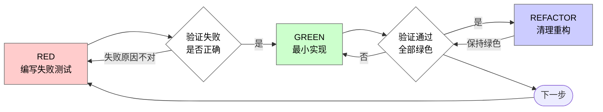

# 测试驱动开发（TDD）

## 概览

先写测试。看着它失败。写出刚好能通过的最小代码。

**核心原则：** 如果你没有亲眼看着测试先失败，你就不知道它测的到底是不是正确的东西。

**违反规则的字面要求，就是在违反规则的精神。**

## Spec 驱动的 TDD

当你基于 spec 实现功能时，先从 spec 的验收标准、公共入口和可观察结果出发，编写 RED 测试。优先写那些能覆盖 spec 所承诺的公共行为的测试。只有在通过公共入口覆盖明显不合理时，才直接测试更底层 helper；而且这些 helper 测试也必须与某条验收标准绑定。

**分支参考禁令：** 除非你的 human partner 明确要求，否则严禁参考仓库内其他分支的代码实现来塑形当前测试或实现。先在当前分支写出 RED 测试，再从这些测试出发实现。

## 何时使用

**始终适用：**
- 新功能
- Bug 修复
- 重构
- 行为变更

**例外情况（先问你的 human partner）：**
- 一次性原型
- 生成代码
- 配置文件

如果你脑子里冒出“这次就先跳过 TDD 吧”，停下。这就是在自我合理化。

## 铁律

```
没有先失败的测试，就不准写生产代码
```

测试之前就写了代码？删掉。重新来。

**没有例外：**
- 不要把它留着当“参考”
- 不要一边写测试一边“顺手改造”
- 不要再去看它
- 说删掉，就是真的删掉

从测试出发重新实现。到此为止。

## Red-Green-Refactor



### RED：编写失败测试

写一个最小测试，明确展示“应该发生什么”。

<Good>
```typescript
test('retries failed operations 3 times', async () => {
  let attempts = 0;
  const operation = () => {
    attempts++;
    if (attempts < 3) throw new Error('fail');
    return 'success';
  };

  const result = await retryOperation(operation);

  expect(result).toBe('success');
  expect(attempts).toBe(3);
});
```
名字清晰、测试真实行为、只测一件事
</Good>

<Bad>
```typescript
test('retry works', async () => {
  const mock = jest.fn()
    .mockRejectedValueOnce(new Error())
    .mockRejectedValueOnce(new Error())
    .mockResolvedValueOnce('success');
  await retryOperation(mock);
  expect(mock).toHaveBeenCalledTimes(3);
});
```
名字含糊，测试的是 mock，不是代码
</Bad>

**要求：**
- 只测一个行为
- 名字清晰
- 使用真实代码（除非无法避免，否则不要 mock）

### 验证 RED：亲眼看它失败

**强制要求。绝不能跳过。**

```bash
npm test path/to/test.test.ts
```

确认：
- 测试失败了（不是报错）
- 失败信息符合预期
- 失败原因是功能缺失（不是拼写错误之类）

**测试直接通过？** 说明你测的是现有行为。去修测试。

**测试报错而不是失败？** 先修错误，重新跑，直到它按预期失败为止。

### GREEN：最小实现

写出能让测试通过的最简单代码。

<Good>
```typescript
async function retryOperation<T>(fn: () => Promise<T>): Promise<T> {
  for (let i = 0; i < 3; i++) {
    try {
      return await fn();
    } catch (e) {
      if (i === 2) throw e;
    }
  }
  throw new Error('unreachable');
}
```
刚好够通过
</Good>

<Bad>
```typescript
async function retryOperation<T>(
  fn: () => Promise<T>,
  options?: {
    maxRetries?: number;
    backoff?: 'linear' | 'exponential';
    onRetry?: (attempt: number) => void;
  }
): Promise<T> {
  // YAGNI
}
```
过度设计
</Bad>

不要顺手加功能、重构别的代码，或者“顺便优化”到超出当前测试的范围。

### 验证 GREEN：亲眼看它通过

**强制要求。**

```bash
npm test path/to/test.test.ts
```

确认：
- 测试通过
- 其他测试仍然通过
- 输出是干净的（没有错误、没有警告）

**测试失败？** 修代码，不要改测试。

**其他测试失败？** 如果与这次改动相关，就现在修；如果明显是历史遗留且无关，记录下来，不要在没有你的 human partner 批准的情况下擅自扩大范围。

### REFACTOR：清理重构

只在变绿之后做：
- 去重
- 改善命名
- 抽取 helper

保持测试为绿色。不要新增行为。

### 重复循环

为下一个功能点再写一个失败测试。

## 好测试长什么样

| 维度 | 好 | 坏 |
|------|----|----|
| **最小化** | 只测一件事。名字里有 “and”？拆开。 | `test('validates email and domain and whitespace')` |
| **清晰** | 名字描述行为 | `test('test1')` |
| **表达意图** | 展示期望 API / 行为 | 让人看不出代码应该做什么 |

## 为什么顺序很重要

**“我先写代码，之后补测试验证一下就行”**

代码写完之后才补的测试，一上来就是通过。直接通过并不能证明任何事：
- 你可能测错了东西
- 你可能测的是实现，不是行为
- 你可能漏掉了自己忘记的边界情况
- 你从未见过它真正抓住 bug

测试先写，会逼你先看着它失败，这才能证明它真的在测东西。

**“这些边界情况我都手工测过了”**

手工测试是临时性的。你以为自己测全了，但其实：
- 没有记录说明你测过什么
- 代码一改，你没法稳定重跑
- 一有压力就容易漏场景
- “我试过一次是好的” ≠ 覆盖全面

自动化测试是系统性的。它每次都会以同样方式运行。

**“删掉已经写了 X 小时的代码太浪费了”**

这是沉没成本谬误。时间已经花出去了。你现在真正的选择是：
- 删掉，按 TDD 重写（再花 X 小时，但信心高）
- 留着，事后补测试（30 分钟，但信心低，而且大概率留 bug）

真正浪费的，是把你自己都不信任的代码留在系统里。没有真实测试的“能工作代码”就是技术债。

**“TDD 太教条了，务实一点就是灵活变通”**

TDD 本身就是务实：
- 在提交前抓 bug（比上线后调试更快）
- 防止回归（测试会立刻告诉你哪里坏了）
- 记录行为（测试展示代码该怎么用）
- 支持重构（可以大胆改，测试替你兜底）

所谓“务实”的捷径，最后通常会变成线上调试，而那更慢。

**“事后补测试也能达到同样目标，重要的是精神不是仪式”**

不。事后补测试回答的是“这段代码现在做了什么？”；测试先写回答的是“它应该做什么？”

事后补测试会被你的实现反向塑形。你测的是你已经写出来的东西，而不是需求要求的东西。你验证的是你记得的边界情况，而不是那些在实现前被迫发现的情况。

测试先写，会强迫你在实现之前就发现边界情况。事后补测试只是在验证你“有没有把所有事都记住”。

30 分钟的事后补测 ≠ TDD。你得到了覆盖率，失去了“测试真的能抓问题”的证明。

## 常见自我合理化

| 借口 | 现实 |
|------|------|
| “太简单了，不用测” | 简单代码也会坏。测试只要 30 秒。 |
| “我之后再测” | 一上来就通过的测试证明不了任何事。 |
| “事后补测试也一样” | 事后补测回答“这会做什么？”；测试先写回答“这应该做什么？” |
| “我已经手工测过了” | 临时试一遍 ≠ 系统验证。没有记录，不能重跑。 |
| “删掉 X 小时的工作太浪费” | 这是沉没成本。保留未验证代码才是技术债。 |
| “先留着当参考，再写测试” | 你会忍不住按它改。那仍然是事后补测。删掉就是删掉。 |
| “我得先探索一下” | 可以。探索完就扔掉，然后从 TDD 重新开始。 |
| “这个太难测试了” | 那通常说明设计不清晰。听测试的反馈。难测 = 难用。 |
| “TDD 会拖慢我” | TDD 比调试更快。真正务实 = 测试先写。 |
| “手工测更快” | 手工测证明不了边界情况，而且每改一次都得重测。 |
| “现有代码本来就没测试” | 现在正好轮到你补上。 |

## Red Flags：停下并重来

- 测试之前先写了代码
- 实现之后才补测试
- 测试一上来就通过
- 你解释不清测试为什么失败
- 测试是“之后再补的”
- 你在想“就这一次”
- “我已经手工测过了”
- “事后补测试也能达到同样目的”
- “重要的是精神，不是仪式”
- “先留着当参考” 或 “在现有代码上改一改”
- “都已经花了 X 小时，删掉太浪费”
- “TDD 太教条了，我这是务实”
- “这次情况不一样，因为……”

**这些信号全都意味着：删掉代码。按 TDD 重来。**

## 示例：修一个 Bug

**Bug：** 空邮箱也被接受了

**RED**
```typescript
test('rejects empty email', async () => {
  const result = await submitForm({ email: '' });
  expect(result.error).toBe('Email required');
});
```

**验证 RED**
```bash
$ npm test
FAIL: expected 'Email required', got undefined
```

**GREEN**
```typescript
function submitForm(data: FormData) {
  if (!data.email?.trim()) {
    return { error: 'Email required' };
  }
  // ...
}
```

**验证 GREEN**
```bash
$ npm test
PASS
```

**REFACTOR**
如果接下来需要对多个字段做校验，再抽取验证逻辑。

## 验证清单

在把工作标记为完成前：

- [ ] 每个新增或变更的行为都有测试
- [ ] 在实现前都亲眼看过测试失败
- [ ] 每个测试都因为预期原因失败（功能缺失，而不是拼写错误）
- [ ] 都是用最小代码实现到通过
- [ ] 所有测试都通过
- [ ] 输出干净（无错误、无警告）
- [ ] 测试使用真实代码（除非无法避免才 mock）
- [ ] 已覆盖边界情况和错误路径

有任何一项打不了勾？那你就是跳过了 TDD。重新来。

## 卡住时怎么办

| 问题 | 解法 |
|------|------|
| 不知道该怎么测 | 先写出你希望存在的 API，再先写断言。问你的 human partner。 |
| 测试太复杂 | 设计太复杂。简化接口。 |
| 什么都得 mock | 代码耦合太高。改用依赖注入。 |
| 测试初始化过大 | 抽 helper。还是很复杂？那就简化设计。 |

## 与 Debugging 的关系

发现 bug 了？先写一个能复现它的失败测试。然后按 TDD 循环修。

这个测试既能证明修复有效，也能防止回归。

绝不要在没有测试的情况下修 bug。

## 测试反模式

当你要加 mock 或测试工具函数时，先阅读 `testing-anti-patterns.md`，避免这些常见坑：
- 测试 mock 行为，而不是真实行为
- 在生产类里添加只给测试用的方法
- 没搞清依赖关系就开始 mock

## 最终规则

```
生产代码 → 测试已存在且先失败过
否则 → 这就不是 TDD
```

没有你的 human partner 的许可，不存在例外。
